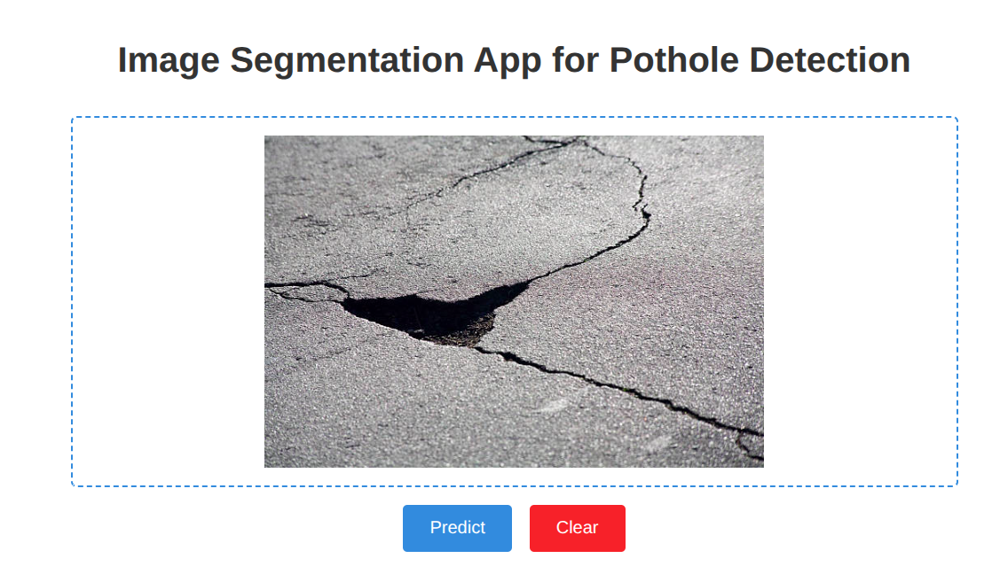
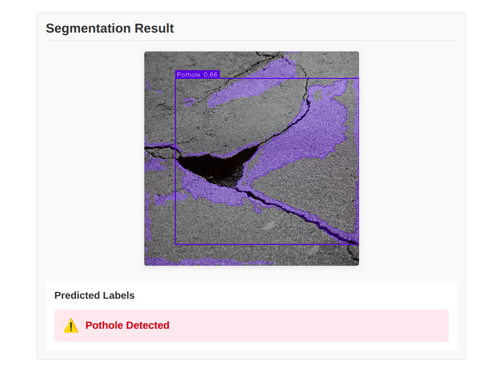

# 🛣️ Pothole Segmentation App

This is a web-based pothole segmentation application that utilizes machine learning to detect and segment potholes in images. The backend uses a pre-trained YOLOv5 model converted to the ONNX format for real-time inference, and the frontend is built using **Svelte**.

Live Demo: https://pothole-segmentation-app.vercel.app/

## Features

* **Image Upload**: Upload images of roads to analyze for potholes.
* **Pothole Segmentation**: The app detects and segments potholes in the image using a trained YOLOv5 model.
* **Interactive UI**: User-friendly interface built with **Svelte**.
* **Image Preview**: See a preview of the uploaded image before submitting for prediction.
* **Clear Image**: Option to clear the uploaded image and start over.

## Tech Stack

* **Frontend**: Svelte, HTML, CSS
* **Backend**: Python, FastAPI, ONNX Runtime
* **Machine Learning Model**: YOLOv8n-seg (converted to ONNX)
* **Deployment**: Render (Backend), Vercel (Frontend)

## Screenshots




## Requirements

Before running the project locally, make sure you have the following installed:

* Node.js (for frontend)
* Python 3.8+ (for backend)
* `pip` (Python package manager)

---

## Frontend Setup

The frontend is built using **Svelte**. It communicates with the backend to send the uploaded image and retrieve the segmented output.

### 1. Clone the repository

```bash
git clone https://github.com/rahul713rk/pothole-segmentation-app.git
cd pothole-segmentation-app/frontend
```

### 2. Install Dependencies

Install the required dependencies for the frontend:

```bash
npm install
```

### 3. Start the Development Server

To run the frontend locally, start the Svelte development server:

```bash
npm run dev
```

---

## Backend Setup

The backend is a FastAPI application that serves the pre-trained YOLOv8n-seg model for pothole segmentation. It handles the file upload and sends back the segmented image.

### 1. Clone the repository

```bash
git clone https://github.com/rahul713rk/pothole-segmentation-app.git
cd pothole-segmentation-app/backend
```

### 2. Create a Virtual Environment (Optional)

You can create a virtual environment for the Python backend to manage dependencies:

```bash
python3 -m venv venv
source venv/bin/activate  # On Windows, use venv\Scripts\activate
```

### 3. Install Dependencies

Install the required dependencies for the backend:

```bash
pip install -r requirements.txt
```

### 4. Start the Backend Server

Start the FastAPI server:

```bash
uvicorn main:app --reload
```

The backend will be available at `http://localhost:8000`.

---

## Deployment

### 1. Frontend (Vercel)

Deploy the frontend to **Vercel** for seamless integration with the backend.

* Go to [Vercel](https://vercel.com/) and link your GitHub repository.
* Select the correct project and deploy.

### 2. Backend (Render)

Deploy the backend to **Render** to handle API requests.

* Go to [Render](https://render.com/) and link your GitHub repository.
* Set up the backend to deploy via a **Python** environment.

---
